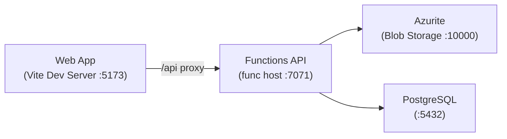

# Azure Debug Plan

> This plan is the source of truth for generating the
> VS Code debug setup in this workspace.
>
> **Status:** Implemented
> **Created:** 2026-06-09T12:00:00Z
> **Last Updated:** 2026-06-09T12:05:00Z

---

## Prerequisites

| Tool / Extension | Required For | Installed | Version | Install |
|-----------------|-------------|-----------|---------|---------|
| Node.js | node-ts runtime | ✅ | 22.18.0 | https://nodejs.org/ |
| npm | Dependency management | ✅ | 10.9.3 | Bundled with Node.js |
| Azure Functions Core Tools | Azure Functions local host | ✅ | 4.10.0 | https://github.com/Azure/azure-functions-core-tools |
| Docker | Running emulators | ✅ | 29.3.1 | https://docs.docker.com/get-docker/ |
| Docker Compose | Orchestrating emulators | ✅ | 5.1.1 | Bundled with Docker Desktop |
| ms-azuretools.vscode-azurefunctions | Task type `func`, problem matchers | ✅ | 1.22.0 | vscode:extension/ms-azuretools.vscode-azurefunctions |

---

## Debug Configurations

Each checked row below produces a VS Code debug configuration in the `.vscode/launch.json`.

| Generate | Debug Config Name | Service Label | Service Root | Project Type | Runtime | Version | Azure Dependencies |
|----------|--------------------|---------------|--------------|--------------|---------|---------|-----|
| [x] | Functions API (debug) | Functions API | ./src/functions | functions | node-ts | 22.x | Azure Storage, PostgreSQL |
| [x] | Web App (debug) | Web App | ./src/web | frontend-spa | node-ts | 22.x | — |
| [x] | Debug All Services | Debug All Services | | *Compound Config* | | | |

> ℹ️ **Proxy detected:** Web App proxies `/api` requests to Functions API (via `vite.config.ts` → `http://localhost:7071`). The compound config starts backends before frontends.

---

## Orchestrator

| Orchestrator | Description |
|-------------|-------------|
| Docker Compose | Uses Docker Compose to orchestrate emulators and dependent services during local development |

---

## Emulators

| Dependent Service | Emulator | Purpose |
|-------------------|----------|---------|
| Azure Storage | Azurite Container | Blob storage for photo uploads and AzureWebJobsStorage |
| PostgreSQL | PostgreSQL Container | Relational database for users, pairs, photos, and captions |

---

## Architecture Diagram

During local debugging, the Vite dev server proxies API calls to the Azure Functions host, which connects to Azurite for blob storage and PostgreSQL for relational data.

---

## Migrations

When selected, the generation phase creates automated VS Code tasks that run migration scripts on launch — so emulator databases are automatically provisioned with the correct schema and seed data before the app starts debugging. No manual migration steps needed.

| Generate | Service | Migration Tool |
|----------|---------|---------------|
| [x] | Functions API | Raw SQL (seeds/migrations/*.sql + seeds/fixtures/seed-data.json) |

---

## API Test Collections

When selected, the generation phase produces lightweight, runnable API test scripts in the project so you can quickly smoke-test endpoints and triggers once everything is launched and connected locally.

| Generate | Service | Description |
|----------|---------|-------------|
| [x] | Functions API | 

HTTP Endpoints (11)
 GET /api/health POST /api/auth/login GET /api/auth/me POST /api/users GET /api/pair/status POST /api/pair/invite POST /api/pair/accept GET /api/photos POST /api/photos/upload DELETE /api/photos/{id} POST /api/photos/{id}/caption  
 |

---

## Convenience Scripts

| Generate | Script | Registered In | Description |
|----------|--------|---------------|-------------|
| [x] | emulators:start | ./package.json | Start all emulators in the background, preserving existing data |
| [x] | emulators:stop | ./package.json | Stop all running emulators |
| [x] | emulators:clean | ./package.json | Stop emulators and delete all data (fresh start) |
| [x] | db:migrate | ./package.json | Apply pending database migrations to the emulator database |

---

## Debug Configuration Checklist

✅ Functions API (debug) — Ready signal observed ("Worker process started and initialized" + 11 functions listed), curl http://localhost:7071/api/health returned 200
✅ Web App (debug) — Ready signal observed ("VITE v8.0.16 ready" + "Local: http://localhost:5173/"), curl http://localhost:5173/ returned 200
✅ Debug All Services — Compound config passes (all member configs validated ✅)
